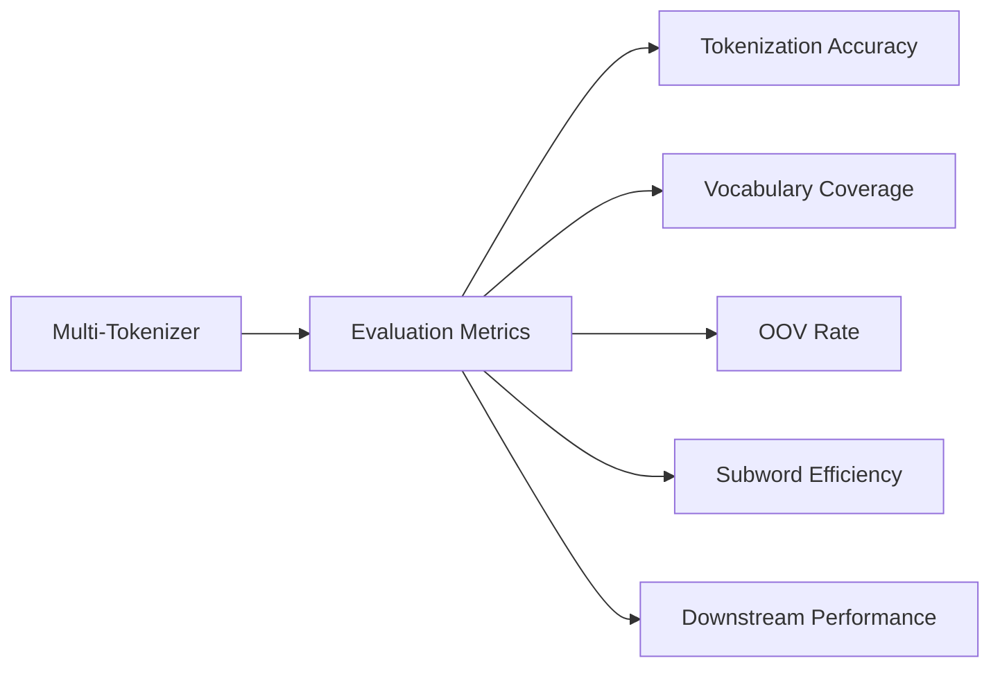
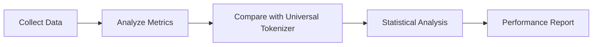

# Evaluation

## Evaluation Metodologies

1. Tokenization Accuracy:
   - Precision = TP / (TP + FP)
   - Recall = TP / (TP + FN)
   - F1 Score = 2 * (Precision * Recall) / (Precision + Recall)
   Where TP = True Positives, FP = False Positives, FN = False Negatives

2. Vocabulary Coverage:
   Coverage = (Tokens in Vocabulary / Total Unique Tokens in Corpus) * 100%

3. Out-of-Vocabulary (OOV) Rate:
   OOV Rate = (Number of OOV Tokens / Total Number of Tokens) * 100%

4. Subword Efficiency:
   Average Subwords per Word = Total Subwords / Total Words

5. Downstream Task Performance:
   - For Translation: BLEU Score
   - For Classification: Accuracy, F1 Score
   - For Named Entity Recognition: CoNLL F1 Score

6. Computational Efficiency:
   - Tokenization Speed = Tokens Processed / Second
   - Memory Usage = Peak Memory Consumption during Tokenization

Explanation: These metrics provide a comprehensive view of tokenizer performance, balancing linguistic accuracy with computational efficiency. The downstream task performance is particularly important as it measures the real-world impact of improved tokenization.

## 7. Data Collection and Analysis

For each tokenization job:

1. Record input text
2. Record detected language
3. Record selected tokenizer
4. Record output tokens
5. Record token IDs
6. Record tokenization time
7. Flag OOV tokens

Explanation: We record this comprehensive set of data to enable thorough analysis and debugging. The tokenization time and OOV flags are particularly important for assessing efficiency and identifying areas for vocabulary improvement.

## 8. Comparative Analysis

Statistical Analysis Methods:
1. Paired t-tests for comparing performance metrics between multi-tokenizer and universal tokenizer
2. ANOVA for comparing performance across multiple languages
3. Regression analysis to identify factors influencing tokenization quality

Explanation: These statistical methods will help us quantify the improvements offered by the multi-tokenizer system and identify areas for further optimization.

## 9. Implementation Plan

1. Develop language detection module
2. Implement individual language tokenizers
3. Create tokenizer selection logic
4. Develop output processing module
5. Implement evaluation suite
6. Conduct initial tests and benchmarking
7. Iterate and optimize based on results

Explanation of approach:
- We start with the language detection module as it's crucial for the system's overall functionality.
- Individual tokenizers are implemented next, allowing for parallel development by different team members.
- The selection logic and output processing are developed once individual tokenizers are functional.
- The evaluation suite is crucial for ongoing optimization and is developed alongside the core system.

## 10. Future Expansion

- Add support for more languages
- Implement adaptive tokenization strategies
- Explore integration with pre-trained language models