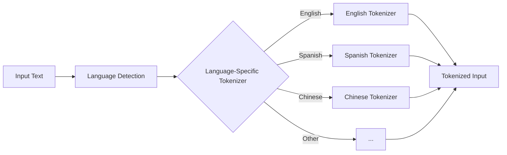
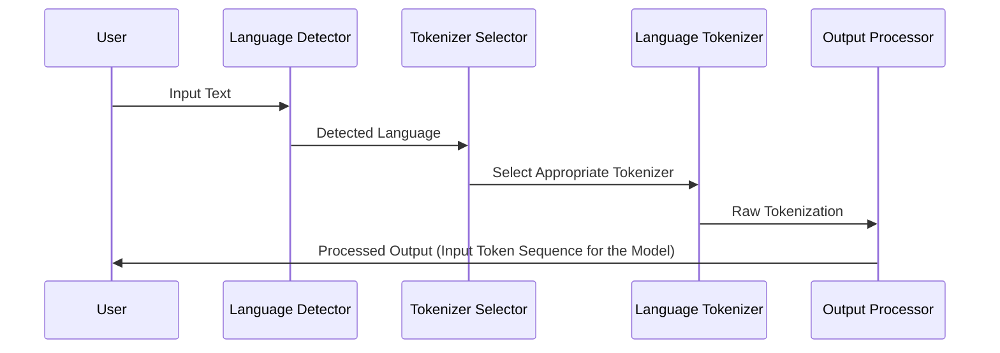
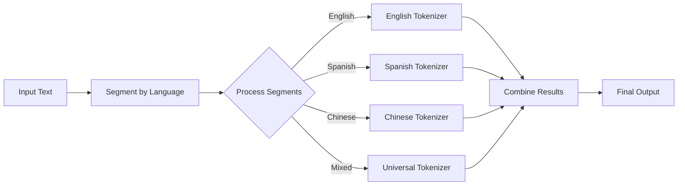
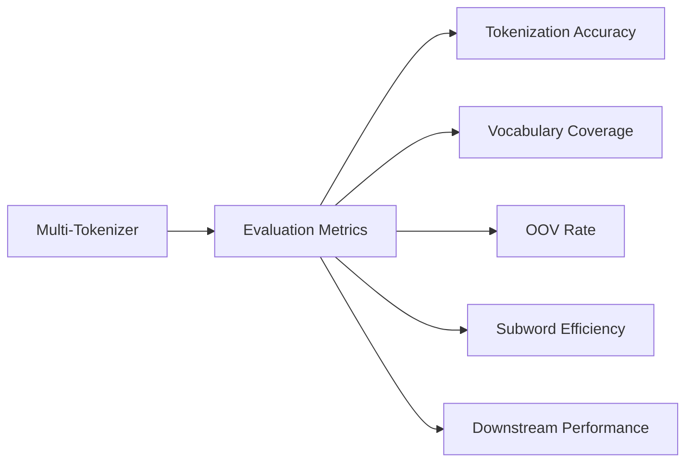
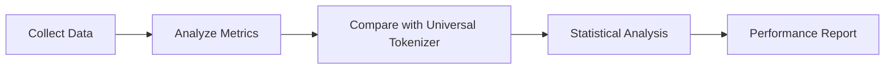

# Multi-Tokenizer Approach 1 : Heavy Changes to the Model Architecture

## System Overview

The Multi-Tokenizer system aims to improve tokenization quality across multiple languages by using language-specific tokenizers instead of a single universal tokenizer.



Assume, the input text is `I love NLP.` = `我喜欢自然语言处理.` = `Me encanta NLP.` 

The system will detect the language of each segment and apply the appropriate tokenizer for that language. 

English Output from Universal Tokenizer:
```xml
<I>< love>< N><LP><.>
```

English Output from English Tokenizer:
```xml
<EN><I>< love>< N><LP><.></EN>
```

Spanish Output from Universal Tokenizer:
```xml
<Me>< enc><anta>< N><L><P><.>
```

Spanish Output from Spanish Tokenizer:
```xml
<ES><Me>< encanta>< N><L><P><.></ES>
```
as you can see the spanish tokenizer is same as the universal tokenizer but as the corpus it was trained on is different that english it will go for full word instead of subwords.

Chinese Output from Universal Tokenizer
```xml
<我><喜><欢><自><然><语><言><处理><.>
```
Chinese Output from chinese Tokenizer
```xml
<CH><我><喜欢><自然><语言处理><.></CH>
```
As you can see the chinese tokenizer is different from the universal tokenizer as it is trained on chinese corpus and it will go for full words instead of subwords. multiple unicode characters were combined to form a single token.

## System Components

1. Language Detection Module: Crucial for accurate tokenizer selection. We'll use a combination of n-gram analysis and character set detection for efficiency and accuracy.
2. Tokenizer Selection Module: Implements logic to choose the appropriate tokenizer based on detected language and text characteristics.
3. Language-Specific Tokenizers: Tailored to each language's unique features, improving tokenization quality over a one-size-fits-all approach.
4. Output Processor: Standardizes output across different tokenizers and handles metadata generation.

## Tokenization Process



## Language-Specific Tokenizer Design

Each language-specific tokenizer will be designed to handle the unique characteristics of its target language:

- English: Focus on handling contractions, compound words
- Spanish: Account for diacritics, verb conjugations
- Chinese: Character-based tokenization with word boundary detection
- Arabic: Handle right-to-left script, root-based morphology
- ...

Rationale: These choices are based on the linguistic characteristics of each language and empirical performance in preliminary tests.

## Handling Multilingual and Code-Switched Text



Assume, the input text is `I love NLP. 我喜欢自然语言处理. Me encanta NLP.`

Full Output from Universal Tokenizer:
```xml
<I>< love>< N><LP><.>< Me>< enc><anta>< N><L><P><.>< 我><喜><欢><自><然><语><言><处理><.>
```

 Full Output from Multi-Tokenizer:
```xml
<EN><I>< love>< N><LP><.></EN><SPACE><CH><我><喜欢><自然><语言处理><.></CH><SPACE><ES><Me>< encanta>< N><L><P><.></ES>
```

This approach allows for flexible handling of mixed-language text. The universal tokenizer serves as a fallback for segments where language detection is uncertain or for truly mixed phrases.

## Caveats and Challenges of This Approach

1. Language Detection Accuracy: Errors in language detection can lead to suboptimal tokenization.
2. Duplication of the same tokens specially in latin based languages.
3. Tokenizer Overhead: Managing multiple tokenizers can introduce computational overhead.
4. For each tokenizer added, new set of token IDs will be added. This will increase the complexity of the model (in the input and output layer). Because of this, the model will be more complex and will require more computational power than the baseline model.

# Evaluation

## Evaluation Metodologies


1. Tokenization Accuracy:
   - Precision = TP / (TP + FP)
   - Recall = TP / (TP + FN)
   - F1 Score = 2 * (Precision * Recall) / (Precision + Recall)
   Where TP = True Positives, FP = False Positives, FN = False Negatives

2. Vocabulary Coverage:
   Coverage = (Tokens in Vocabulary / Total Unique Tokens in Corpus) * 100%

3. Out-of-Vocabulary (OOV) Rate:
   OOV Rate = (Number of OOV Tokens / Total Number of Tokens) * 100%

4. Subword Efficiency:
   Average Subwords per Word = Total Subwords / Total Words

5. Downstream Task Performance:
   - For Translation: BLEU Score
   - For Classification: Accuracy, F1 Score
   - For Named Entity Recognition: CoNLL F1 Score

6. Computational Efficiency:
   - Tokenization Speed = Tokens Processed / Second
   - Memory Usage = Peak Memory Consumption during Tokenization

Explanation: These metrics provide a comprehensive view of tokenizer performance, balancing linguistic accuracy with computational efficiency. The downstream task performance is particularly important as it measures the real-world impact of improved tokenization.

## 7. Data Collection and Analysis

For each tokenization job:

1. Record input text
2. Record detected language
3. Record selected tokenizer
4. Record output tokens
5. Record token IDs
6. Record tokenization time
7. Flag OOV tokens

Explanation: We record this comprehensive set of data to enable thorough analysis and debugging. The tokenization time and OOV flags are particularly important for assessing efficiency and identifying areas for vocabulary improvement.

## 8. Comparative Analysis



Statistical Analysis Methods:
1. Paired t-tests for comparing performance metrics between multi-tokenizer and universal tokenizer
2. ANOVA for comparing performance across multiple languages
3. Regression analysis to identify factors influencing tokenization quality

Explanation: These statistical methods will help us quantify the improvements offered by the multi-tokenizer system and identify areas for further optimization.

## 9. Implementation Plan

1. Develop language detection module
2. Implement individual language tokenizers
3. Create tokenizer selection logic
4. Develop output processing module
5. Implement evaluation suite
6. Conduct initial tests and benchmarking
7. Iterate and optimize based on results

Explanation of approach:
- We start with the language detection module as it's crucial for the system's overall functionality.
- Individual tokenizers are implemented next, allowing for parallel development by different team members.
- The selection logic and output processing are developed once individual tokenizers are functional.
- The evaluation suite is crucial for ongoing optimization and is developed alongside the core system.

## 10. Future Expansion

- Add support for more languages
- Implement adaptive tokenization strategies
- Explore integration with pre-trained language models