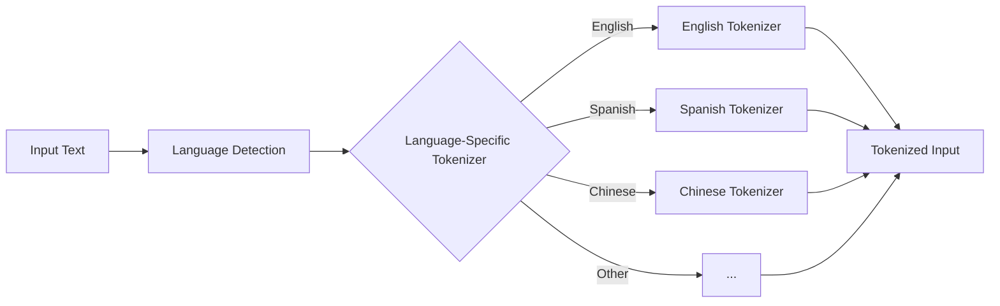
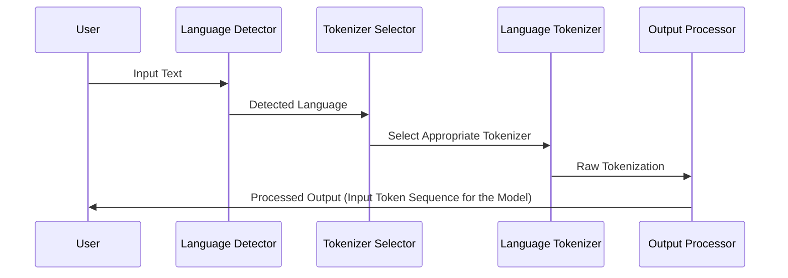

# Multi-Tokenizer Approach 1 : Heavy Changes to the Model Architecture

## System Overview

The Multi-Tokenizer system aims to improve tokenization quality across multiple languages by using language-specific tokenizers instead of a single universal tokenizer.



Assume, the input text is `I love NLP.` = `我喜欢自然语言处理.` = `Me encanta NLP.` 

The system will detect the language of each segment and apply the appropriate tokenizer for that language. 

English Output from Universal Tokenizer:
```xml
<I>< love>< N><LP><.>
```

English Output from English Tokenizer:
```xml
<EN><I>< love>< N><LP><.></EN>
```

Spanish Output from Universal Tokenizer:
```xml
<Me>< enc><anta>< N><L><P><.>
```

Spanish Output from Spanish Tokenizer:
```xml
<ES><Me>< encanta>< N><L><P><.></ES>
```
as you can see the spanish tokenizer is same as the universal tokenizer but as the corpus it was trained on is different that english it will go for full word instead of subwords.

Chinese Output from Universal Tokenizer
```xml
<我><喜><欢><自><然><语><言><处理><.>
```
Chinese Output from chinese Tokenizer
```xml
<CH><我><喜欢><自然><语言处理><.></CH>
```
As you can see the chinese tokenizer is different from the universal tokenizer as it is trained on chinese corpus and it will go for full words instead of subwords. multiple unicode characters were combined to form a single token.

## System Components

1. Language Detection Module: Crucial for accurate tokenizer selection. We'll use a combination of n-gram analysis and character set detection for efficiency and accuracy.
2. Tokenizer Selection Module: Implements logic to choose the appropriate tokenizer based on detected language and text characteristics.
3. Language-Specific Tokenizers: Tailored to each language's unique features, improving tokenization quality over a one-size-fits-all approach.
4. Output Processor: Standardizes output across different tokenizers and handles metadata generation.

## Tokenization Process



## Language-Specific Tokenizer Design

Each language-specific tokenizer will be designed to handle the unique characteristics of its target language:

- English: Focus on handling contractions, compound words
- Spanish: Account for diacritics, verb conjugations
- Chinese: Character-based tokenization with word boundary detection
- Arabic: Handle right-to-left script, root-based morphology
- ...

Rationale: These choices are based on the linguistic characteristics of each language and empirical performance in preliminary tests.