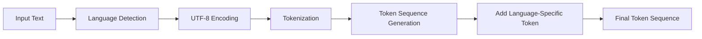
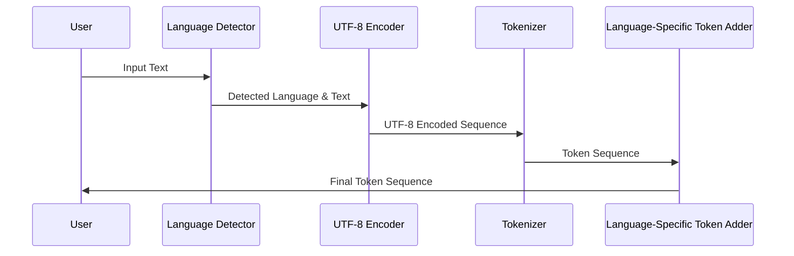

# Multi-Tokenizer Approach 2: Light Changes to the Model Architecture

## System Overview

This approach aims to improve tokenization across multiple languages while minimizing changes to the model architecture. It uses a shared vocabulary for all languages, with additional language-specific tokens.



## System Components

1. Language Detection Module: Identifies the language of the input text.
2. UTF-8 Encoder: Converts text to UTF-8 byte sequences.
3. Tokenizer: Processes UTF-8 sequences into tokens.
4. Language-Specific Token Adder: Prepends language identifier tokens.

## Tokenization Process



## Vocabulary Design

The vocabulary consists of following tokens additional to the default latin based tokens:
1. UTF-8 Byte Sequence Start specifier: `b\xe6`, `b\xe7`, etc. Helps the tokenizer identify the start of a new UTF-8 sequence.
2. UTF-8 byte tokens (0-255): 256 tokens:  `\x00`, `\x01`, ..., `\xff`
3. Subword tokens: Most common byte sequences: `\xe6\x88`, `\xe5\x96`, `b\xe8\x87`, etc.
4. Language-specific tokens: `<EN>`, `<ES>`, `<CH>`,`</EN>`, `</ES>`, `</CH>` etc.

Total additional tokens: 256 (byte tokens) + ~1000 (subword tokens) + ~10 (language tokens) = 1266

## Tokenization Examples

Assume the input text is `I love NLP.` = `我喜欢自然语言处理.` = `Me encanta NLP.`

English Output:
```xml
<EN><I>< love>< N><L><P><.></EN>
```

Chinese Output:
```xml
<CH><b\xe6><\x88><\x91><b\xe5><\x96\x9c><b\xe6><\xac><\xa2><b\xe8><\x87\xaa><b\xe7><\x84><\xb6><b\xe8\xaf><\xad><b\xe8><\xa8><\x80><b\xe5\xa4><\x84><b\xe7><\x90><\x86><.></CH>
```

Spanish Output:
```xml
<ES><Me>< enc><anta>< N><L><P><.></ES>
```

## Advantages

1. Minimal increase in vocabulary size
2. Unified tokenization approach across languages
3. Efficient handling of multi-language inputs
4. Reduced model complexity compared to Approach 1

## Challenges and Considerations

1. Potential loss of language-specific nuances in tokenization
2. Increased reliance on the model to learn language-specific patterns
3. Possible increase in sequence length for non-Latin script languages

## Implementation Steps

1. Develop a robust language detection module
2. Create a UTF-8 encoding and tokenization pipeline
3. Generate a shared vocabulary based on a multi-language corpus
4. Implement the language-specific token addition mechanism
5. Integrate the system with the existing model architecture
6. Fine-tune the model on multi-language data using the new tokenization approach

This approach offers a balance between improved multi-language support and minimal changes to the model architecture, potentially leading to better performance across various languages without significantly increasing model complexity.
